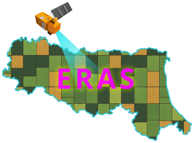

# 🌍 Emilia-Romagna Agri Seg (ERAS)
<p align="center" width="100%">
     
</p>

A regional dataset for crop segmentation. This dataset is the complement for *"Segment Anything for Satellite Imagery: A Strong Baseline and a Regional Dataset for Automatic Field Delineation"*, accepted for publication at ICIAP 2025.

## 📦 Dataset Overview

This dataset includes pre-processed Sentinel-2 images and corresponding instance masks for cultivated fields.

- **Source Imagery:** Copernicus Sentinel-2 (Level-2A)
- **Annotations:** Cultivated fields instance segmentation masks
- **Number of Images:** `14 968`
- **Image Resolution:** `256x256` at `10m / pixel`
- **Geographic Coverage:** `Emilia Romagna (ER) Region, Italy.`
- **File Format:**  
  - Images: `RGB GeoTIFF`
  - Masks: `geojson` vectors.

## 📁 Dataset Structure
The dataset is organized by province, with each province subfolder following an identical internal structure.

- Province Codes: Bologna (`BO`), Forli-Cesena (`FC`), Ferrara (`FE`), Modena (`MO`), Piacenza(`PC`), Parma (`PR`), Ravenna (`RA`), Reggio Emilia (`RE`), Ravenna (`RN`)

Within each province folder:
```
<PROVINCE_CODE>/
  ├── tiff/
  │     └── s2/
  │          ├── n_2023-01-01T00:00:00Z.tif
  │          ├── n_2023-04-01T00:00:00Z.tif
  │          ├── n_2023-07-01T00:00:00Z.tif
  │          └── n_2023-10-01T00:00:00Z.tif
  │
  └── geojson/
        └── n.geojson

```

- `tiff/s2/`: contains quarterly cloudless Sentinel-2 RGB GeoTIFF images for 2023.
- `geojson/`: contains the corresponding field boundary vectors in GeoJSON format.

***⚠️ Important***\
For each tile (image set), there are 4 temporal observations — one for each quarter of 2023 — derived from the [Quarterly cloudless Sentinel-2 mosaics](https://dataspace.copernicus.eu/news/2023-11-28-quarterly-cloudless-sentinel-2-mosaics-available-data-collections-and-copernicus) 

> **Note**: All four quarterly images for a given tile share the same field boundaries vector (n.geojson).

## 📥 Download

Download the dataset from [Our Google Drive Link](https://drive.google.com/file/d/1ti4n2FkpvntDF2h9tvwXK74tYsVdhNx0/view?usp=drive_link)

## 📊 Example Usage

In this repository, we provide sample code to load and preprocess ERAS using Pytorch.

### Requirements

<details>
<summary>Setup Anaconda Environment</summary>
  
```
conda create -n eras python=3.10
conda activate eras
conda install pytorch torchvision torchaudio pytorch-cuda=11.8 -c pytorch -c nvidia # 2,4,1
pip install albumentations
pip install opencv-python
pip install rioxarray
conda install -c conda-forge xarray dask netCDF4 bottleneck h5py
pip install geopandas
pip install shapely
pip install matplotlib
```
</details>


## 📜 License

This dataset is licensed under the **[Creative Commons Attribution 4.0 International (CC BY 4.0)](https://creativecommons.org/licenses/by/4.0/)**.

When using this dataset, please credit:
> - **European Space Agency (ESA)** for the original Sentinel-2 imagery.
> - **C. Scribano et, al.** for dataset compilation and instance segmentation annotations.


###  Disclaimer

> This dataset is derived from Copernicus Sentinel-2 satellite imagery provided by the European Space Agency (ESA). ESA and the European Commission are not responsible for the use or interpretation of this dataset. The creators of this dataset make no warranties regarding its accuracy, completeness, or fitness for a particular purpose.

## 🤝 Citation

If you use this dataset in your work, please cite it as:
```
@misc{scribano2025segmentsatelliteimagerystrong,
      title={Segment Anything for Satellite Imagery: A Strong Baseline and a Regional Dataset for Automatic Field Delineation}, 
      author={Carmelo Scribano and Elena Govi and Paolo Bertellini and Simone Parisi and Giorgia Franchini and Marko Bertogna},
      year={2025},
      eprint={2506.16318},
      archivePrefix={arXiv},
      primaryClass={cs.CV},
      url={https://arxiv.org/abs/2506.16318}, 
}
```
